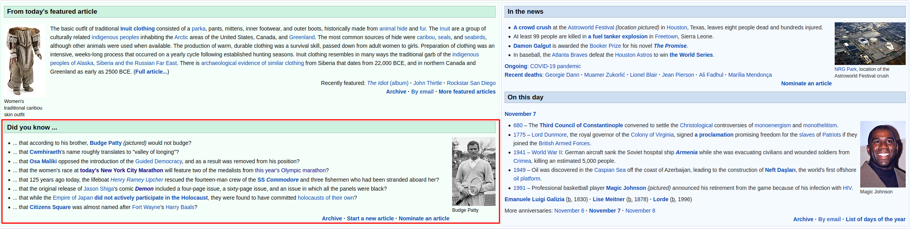

# Scrapper Example


Exemplo de crawler simples para demonstração na PodCodar :exploding_head:!

## O que este projeto faz

Este projeto é composto de alguns serviços:

- Crawler (/crawler)
- App (/app)

## Crawler

Este é um crawler feito com a biblioteca [Puppeteer](https://pptr.dev/), ele simula a navegação de usuário.
Primeiro ele irá acessar a página principal da [Wikipedia](https://en.wikipedia.org/), após atestar o carregamento
da página ele irá baixar os textos e links da área `Did You Know` do site:



Ao final de sua execução, o crawler irá gerar um novo arquivo: `data.json (/crawler/data.json)` no seguinte formato:

```json
{
  "12312012301": {
    "fullText": "Full text from quote",
    "links": [
      {
        "value": "link para redirecionamento",
        "text": "texto do link"
      },
      ...
    ]
  },
  ...
}
```

A chave principal do objeto acima representa a data do dia que a informação foi coletada, no formato padrão `Data.now()`.
Estes dados vão ser utilizados na próxima parte desta aplicação, o App!

**Rodando o Crawler**

```bash
cd crawler
yarn
yarn crawl
```

## App

Um App simples escrito em `Typescript` que consome os dados coletados pelo crawler para re-organizálos e demonstrálos
em um novo formato.

Bibliotécas utilizadas:

- React
- Chakra UI

**Rodando o App**

```bash
cd app
yarn
yarn start
```
